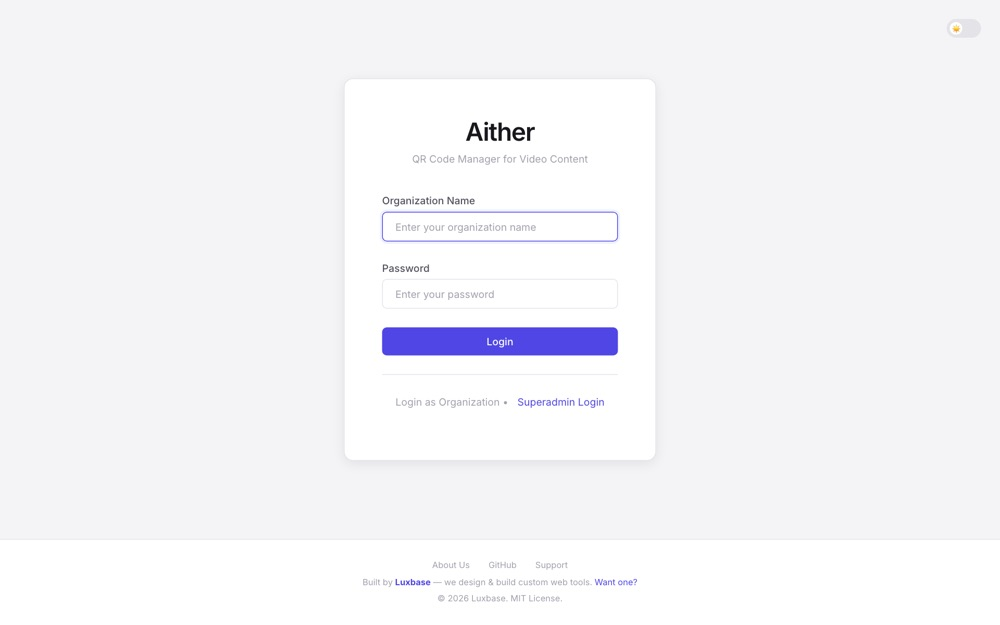

# Aither

A static, client-side QR code generator and manager for video content — built for exhibits, events, advertising campaigns, and digital signage where visitors scan a code and watch a video instantly.

> Built by **[Luxbase](https://luxbase.github.io/)** — we design & build custom web tools. Need one? [Get in touch.](https://luxbase.github.io/)

## Why it exists

Teams running exhibits and campaigns need "scan this QR, watch this video" without standing up a backend. Aither runs 100% in the browser: it stores video **URLs** (not files) in IndexedDB, generates styled QR codes, and serves scans through a mobile-optimized video player page. No server, no accounts, no hosting costs beyond static files.

## Live demo

**[luxbase.github.io/Aither](https://luxbase.github.io/Aither/)**

A public sandbox on GitHub Pages — all data lives only in *your* browser, so nothing you do affects other visitors. The admin area is gated by a superadmin password (not published here); the video player pages are fully public.



## Security note

**Authentication is client-side only and is NOT a real security boundary.** Passwords are SHA-256 hashed (unsalted) and compared in the browser; session tokens live in plain `localStorage`. Anyone with devtools can bypass the login in seconds. This is suitable only for casual gating of trusted-staff workflows — never for protecting sensitive data. The production build's JavaScript obfuscation is a deterrent, not protection. If you need real security, put the app behind server-side auth (or a service like Auth0/Firebase Auth). Full details: [SECURITY.md](SECURITY.md).

## Features

- **Pure static app** — no backend; data persists per browser/device via IndexedDB (Dexie). No cross-device sync; use export/import to move data.
- **Styled QR generation** — colors, sizes, margins, optional logo; export as PNG or SVG.
- **Smart video player** — MP4 URLs get a QR that opens a custom player page (`player.html`) with auto-fullscreen, landscape lock on mobile, and a built-in "scan another QR" camera flow.
- **Bulk collections** — paste a directory-listing URL or a list of URLs to generate a whole batch of QR codes at once; rescan collections to pick up new videos.
- **Multi-tenant organizations** — a superadmin creates organizations, each with its own password and isolated QR library (per device).
- **Light/dark theme**, keyboard shortcuts, responsive layout.

## Tech stack

- **Build**: Vite 8 · terser · javascript-obfuscator
- **Storage**: IndexedDB via Dexie.js
- **QR**: qr-code-styling (generation) · html5-qrcode (in-player scanning)
- **Language**: vanilla HTML/CSS/JavaScript — no framework

## Getting started

Requires Node.js 20.19+ or 22.12+.

```bash
git clone https://github.com/luxbase/Aither.git
cd Aither
npm install

# Configure the superadmin password (never commit real values)
cp .env.example .env
npm run hash-password        # prompts for a password, prints the SHA-256 hash
# paste the hash into .env as VITE_ADMIN_PASS_HASH

npm run dev                  # http://localhost:3010/login.html
```

First run: log in via the "Superadmin" option (or `/login.html?admin=true`), create an organization in `/admin.html`, then sign in with that organization to generate and manage QR codes.

## Build & deploy

```bash
npm run build   # static output in dist/
```

Deployable to any static host:

- **GitHub Pages** — this repo ships a workflow ([.github/workflows/deploy-pages.yml](.github/workflows/deploy-pages.yml)) that builds and deploys on push to `main`, reading `VITE_ADMIN_PASS_HASH` from repository variables.
- **Vercel** — [vercel.json](vercel.json) is included; set `VITE_ADMIN_PASS_HASH` in Project Settings → Environment Variables, then redeploy (Vite bakes env vars in at build time).
- **Anything else** — copy `dist/` to your web root.

## Project structure

```
index.html            # QR generator app
login.html            # Login page
admin.html            # Superadmin panel (organizations)
player.html           # Public video player (target of QR scans)
reset-admin.html      # Superadmin password reset utility
scripts/hash-password.js
src/js/               # auth, db (Dexie), qr, ui, theme, parser
src/styles/           # theme vars, layout, components, player
```

## Documentation

- [USER_GUIDE.md](USER_GUIDE.md) — end-user walkthrough
- [SECURITY.md](SECURITY.md) — security model, limitations, disclosure policy
- [TERMS.md](TERMS.md) · [CHANGELOG.md](CHANGELOG.md)

## Contributing

Fork → feature branch → `npm run check` → smoke-test the first-run flow in a browser (auth, QR generation, player, storage) → PR.

## License

MIT — see [LICENSE](LICENSE). © 2026 Luxbase.

Support & security contact: daniel.oceno@outlook.com (see [SECURITY.md](SECURITY.md) for responsible disclosure).
